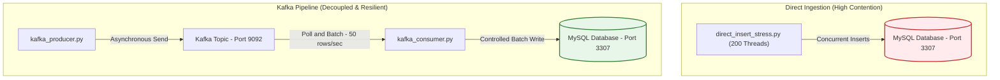
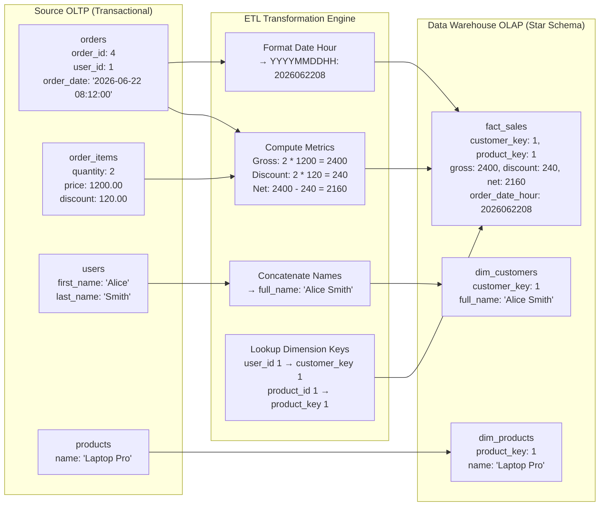

# MySQL vs. Kafka Data Pipeline Load Testing

This repository provides a hands-on demonstration and load testing lab comparing **Direct Database Ingestion** with **Queue-based Ingestion (Kafka + Consumer)**. It is designed for students to understand system bottlenecks, connection limits, and how message queues add decoupling and resilience to data pipelines.

---

## Architecture Overview



1. **Direct Ingestion Test**: Simulates concurrent clients flooding the database directly with writes. Demonstrates MySQL `Too many connections` limits and capacity issues under spike loads.
2. **Kafka Pipeline Test**: Simulates clients writing rapidly to Kafka. A consumer reads messages in batches and writes them at a controlled pace to the database. Demonstrates buffering and steady write throughput.

---

## Getting Started

### 1. Prerequisites
Make sure you have the following installed on your machine:
*   [Docker Desktop](https://www.docker.com/products/docker-desktop/)
*   [Python 3.10+](https://www.python.org/downloads/)

### 2. Start the Infrastructure
Spin up the MySQL database and Kafka broker containers in the background:
```bash
docker compose up -d
```
*Verify containers are running:*
```bash
docker compose ps
```

### 3. Setup Python Virtual Environment
Initialize a virtual environment and install the required dependencies:
```bash
# Create virtual environment
python3 -m venv venv

# Activate virtual environment
# On macOS/Linux:
source venv/bin/activate
# On Windows:
# .\venv\Scripts\activate

# Install requirements
pip install -r requirements.txt
```

---

## Running the Stress Tests

### Test 1: Direct Database Ingestion (Direct Flooding)
Run this command to simulate 200 concurrent threads making inserts directly into the MySQL database for **1 minute**:
```bash
python direct_insert_stress.py --duration 60
```

#### What to observe:
*   You will see multiple errors printed: `Error: 1040: Too many connections`.
*   Under high concurrency, the database exceeds its connection limits, resulting in failed writes and lost data.

---

### Test 2: Kafka Queue Ingestion (Resilient Pipeline)
In this test, data is sent to Kafka first, and then written to the database in a controlled batch process.

#### Step 2a: Start the Consumer
Open a terminal, activate your virtual environment, and run the consumer. It will stay open to listen and batch-write incoming records:
```bash
python kafka_consumer.py
```

#### Step 2b: Run the Producer (in another terminal)
Open a new terminal window, activate your virtual environment, and run the producer for **1 minute**:
```bash
python kafka_producer.py --duration 60
```

#### What to observe:
*   The producer sends and queues messages into Kafka extremely fast without any errors.
*   The consumer reads from Kafka, batching them into groups of 50 or flushing every 1.0 second, maintaining database stability.
*   Zero writes are failed or lost.

---

## Checking the Database Records
You can run these commands in your terminal to inspect the database:

*   **Check the total count of inserted records:**
    ```bash
    docker exec -it pipeline-mysql mysql -u pipeline_user -ppipeline_password pipeline_db -e "SELECT COUNT(*) FROM sensor_readings;"
    ```
*   **See the latest 10 records inserted:**
    ```bash
    docker exec -it pipeline-mysql mysql -u pipeline_user -ppipeline_password pipeline_db -e "SELECT * FROM sensor_readings ORDER BY id DESC LIMIT 10;"
    ```

---

## Airflow Batch ETL Lab (OLTP to OLAP Star Schema)

This lab demonstrates how to build a batch ETL pipeline that runs every hour to sync transactional orders from a **Source OLTP Database (`source_db`)** into an analytical **Data Warehouse Star Schema (`warehouse_db`)**.

### Data Ingestion & Transformation Flow



### Real Data Transformation Mapping

#### 1. Source Transactional Records (Input)
*   **`source_db.users`**:
    ```
    user_id = 1 | first_name = "Alice" | last_name = "Smith" | country = "USA"
    ```
*   **`source_db.products`**:
    ```
    product_id = 1 | name = "Laptop Pro" | category = "Electronics" | price = 1200.00
    ```
*   **`source_db.orders`**:
    ```
    order_id = 4 | user_id = 1 | order_date = "2026-06-22 08:12:00" | status = "completed"
    ```
*   **`source_db.order_items`**:
    ```
    item_id = 12 | order_id = 4 | product_id = 1 | quantity = 2 | unit_price = 1200.00 | discount = 120.00
    ```

#### 2. Transformed Warehouse Dimensions (Output)
*   **`warehouse_db.dim_customers`** (User names merged, country mapped):
    ```
    customer_key = 1 | user_id = 1 | full_name = "Alice Smith" | country = "USA"
    ```
*   **`warehouse_db.dim_products`** (Catalog info loaded):
    ```
    product_key = 1 | product_id = 1 | name = "Laptop Pro" | category = "Electronics"
    ```

#### 3. Transformed Sales Fact Table (Output)
*   **`warehouse_db.fact_sales`** (Surrogate keys resolved, financial metrics computed, date-hour key extracted):
    ```
    sales_key = 1 | order_id = 4 | customer_key = 1 | product_key = 1 | quantity = 2
    gross_amount = 2400.00 | discount_amount = 240.00 | net_amount = 2160.00 | order_date_hour = 2026062208
    ```

---

### Step-by-Step Running Guide

#### 1. Start the Airflow Environment
Launch Postgres metadata database, Airflow Webserver, and Scheduler alongside MySQL:
```bash
docker compose -f docker-compose.yml -f docker-compose-airflow.yml up -d
```

#### 2. Initialize schemas & Generate Mock Data
This script creates the schemas for both `source_db` (OLTP) and `warehouse_db` (OLAP) and seeds them with random e-commerce orders:
```bash
python data_etl/scripts/seed_data.py
```

#### 3. Run the ETL DAG via Airflow
*   Open the Airflow Webserver UI at [http://localhost:8080](http://localhost:8080) (Log in with username `admin` and password `admin`).
*   Find the **`ecommerce_hourly_etl`** DAG and unpause it (toggle the switch).
*   Trigger the DAG manually by clicking the **Play button** on the top right.
*   *Alternatively, trigger the DAG from the CLI:*
    ```bash
    docker exec pipeline-airflow-webserver airflow dags trigger ecommerce_hourly_etl
    ```

#### 4. Query the Transformed Data Warehouse Records
Verify that the analytical tables were populated correctly:
```bash
docker exec -it pipeline-mysql mysql -u pipeline_user -ppipeline_password warehouse_db -e "SELECT * FROM fact_sales LIMIT 5;"
```
```bash
docker exec -it pipeline-mysql mysql -u pipeline_user -ppipeline_password warehouse_db -e "SELECT * FROM dim_customers LIMIT 5;"
```
```bash
docker exec -it pipeline-mysql mysql -u pipeline_user -ppipeline_password warehouse_db -e "SELECT * FROM dim_products LIMIT 5;"
```
```bash
# Get overall summary metrics
docker exec -it pipeline-mysql mysql -u pipeline_user -ppipeline_password warehouse_db -e "SELECT COUNT(*) AS total_sales_records, SUM(gross_amount) AS total_gross, SUM(net_amount) AS total_net FROM fact_sales;"
```
```bash
# Query total sales revenue by country
docker exec -it pipeline-mysql mysql -u pipeline_user -ppipeline_password warehouse_db -e "SELECT c.country, SUM(f.net_amount) AS total_revenue FROM fact_sales f JOIN dim_customers c ON f.customer_key = c.customer_key GROUP BY c.country;"
```

---

## Educational Takeaways
1.  **Connection Saturation**: Databases have limits on concurrent connections (`max_connections`). Bypassing this threshold causes client failures.
2.  **Backpressure & Queuing**: Kafka acts as a buffer. Under load spikes, the producer sends data instantly to Kafka, while the consumer processes it asynchronously at a rate the database can safely handle.
3.  **Batch Ingestion**: Inserting rows in batches (`executemany` in the consumer) is significantly faster than opening a connection and committing a single row for every insert.
