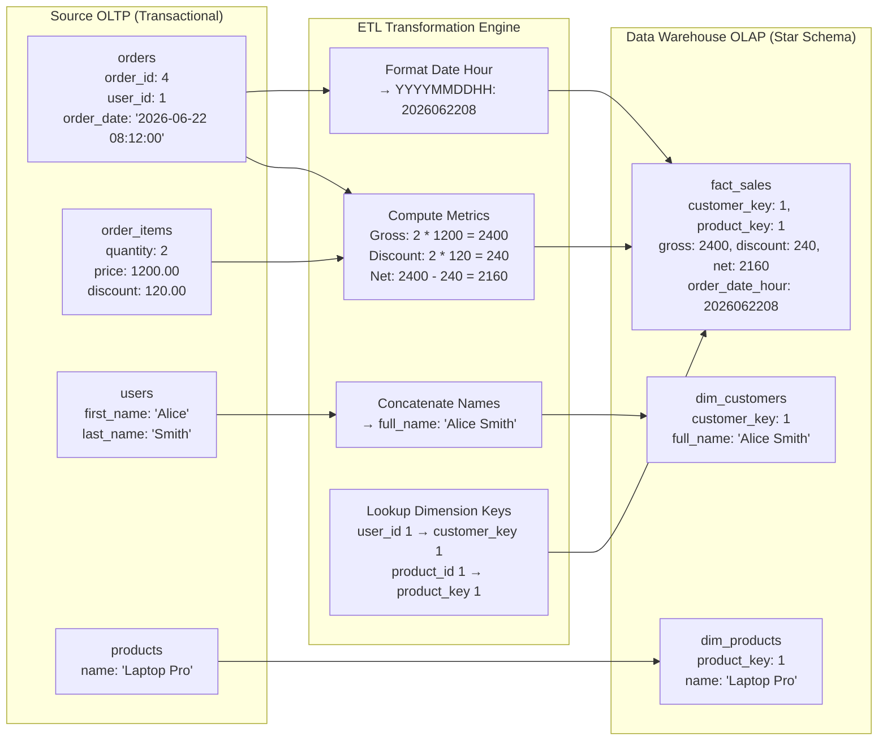

# Airflow Batch ETL Lab (OLTP to OLAP Star Schema)

This directory contains a batch ETL pipeline lab orchestrated by Apache Airflow. It demonstrates how to sync transactional records from a **Source OLTP Database (`source_db`)** into an analytical **Data Warehouse Star Schema (`warehouse_db`)** on an hourly basis.

---

## Data Ingestion & Transformation Flow



---

## Real Data Transformation Mapping

### 1. Source Transactional Records (Input)
*   **`source_db.users`**:
    ```
    user_id = 1 | first_name = "Alice" | last_name = "Smith" | country = "USA"
    ```
*   **`source_db.products`**:
    ```
    product_id = 1 | name = "Laptop Pro" | category = "Electronics" | price = 1200.00
    ```
*   **`source_db.orders`**:
    ```
    order_id = 4 | user_id = 1 | order_date = "2026-06-22 08:12:00" | status = "completed"
    ```
*   **`source_db.order_items`**:
    ```
    item_id = 12 | order_id = 4 | product_id = 1 | quantity = 2 | unit_price = 1200.00 | discount = 120.00
    ```

### 2. Transformed Warehouse Dimensions (Output)
*   **`warehouse_db.dim_customers`** (User names merged, country mapped):
    ```
    customer_key = 1 | user_id = 1 | full_name = "Alice Smith" | country = "USA"
    ```
*   **`warehouse_db.dim_products`** (Catalog info loaded):
    ```
    product_key = 1 | product_id = 1 | name = "Laptop Pro" | category = "Electronics"
    ```

### 3. Transformed Sales Fact Table (Output)
*   **`warehouse_db.fact_sales`** (Surrogate keys resolved, financial metrics computed, date-hour key extracted):
    ```
    sales_key = 1 | order_id = 4 | customer_key = 1 | product_key = 1 | quantity = 2
    gross_amount = 2400.00 | discount_amount = 240.00 | net_amount = 2160.00 | order_date_hour = 2026062208
    ```

---

## Step-by-Step Running Guide

### 1. Start the Airflow Environment
Launch the Postgres metadata database, Airflow Webserver, and Scheduler alongside MySQL:
```bash
docker compose -f docker-compose.yml -f docker-compose-airflow.yml up -d
```

### 2. Initialize schemas & Generate Mock Data
This script creates the schemas for both `source_db` (OLTP) and `warehouse_db` (OLAP) and seeds them with random e-commerce orders:
```bash
# Run this from the root data_pipeline directory
python data_etl/scripts/seed_data.py
```
*(Note: Orders are generated using UTC timestamps to align with Airflow's internal execution windows.)*

### 3. Run the ETL DAG via Airflow
*   Open the Airflow Webserver UI at [http://localhost:8080](http://localhost:8080) (Log in with username `admin` and password `admin`).
*   Find the **`ecommerce_hourly_etl`** DAG and unpause it (toggle the switch).
*   Trigger the DAG manually by clicking the **Play button** on the top right.
*   *Alternatively, trigger the DAG from the CLI:*
    ```bash
    docker exec pipeline-airflow-webserver airflow dags trigger ecommerce_hourly_etl
    ```

### 4. Query the Transformed Data Warehouse Records
Verify that the analytical tables were populated correctly:
```bash
docker exec -it pipeline-mysql mysql -u pipeline_user -ppipeline_password warehouse_db -e "SELECT * FROM fact_sales LIMIT 5;"
```
```bash
docker exec -it pipeline-mysql mysql -u pipeline_user -ppipeline_password warehouse_db -e "SELECT * FROM dim_customers LIMIT 5;"
```
```bash
docker exec -it pipeline-mysql mysql -u pipeline_user -ppipeline_password warehouse_db -e "SELECT * FROM dim_products LIMIT 5;"
```
```bash
# Get overall summary metrics
docker exec -it pipeline-mysql mysql -u pipeline_user -ppipeline_password warehouse_db -e "SELECT COUNT(*) AS total_sales_records, SUM(gross_amount) AS total_gross, SUM(net_amount) AS total_net FROM fact_sales;"
```
```bash
# Query total sales revenue by country
docker exec -it pipeline-mysql mysql -u pipeline_user -ppipeline_password warehouse_db -e "SELECT c.country, SUM(f.net_amount) AS total_revenue FROM fact_sales f JOIN dim_customers c ON f.customer_key = c.customer_key GROUP BY c.country;"
```

---

## Educational Concepts Covered
1.  **OLTP vs. OLAP Separation**: Relational transactional tables vs. de-normalized, high-performance dimensional star schema tables.
2.  **SCD Type 1 (Slowly Changing Dimensions)**: Overwriting customer/product fields upon changes to keep the analytics records up to date.
3.  **Surrogate Key Mapping**: Standard dimensional warehouse practice of mapping natural keys (`user_id`, `product_id`) to integer surrogate keys (`customer_key`, `product_key`).
4.  **Idempotence in Batch Jobs**: Deleting previously loaded orders inside the execution hour window before inserting to prevent duplicates upon job retries.
5.  **Data Quality Testing**: Asserting key completeness and arithmetic validation during execution (preventing bad data from reaching reporting layers).
